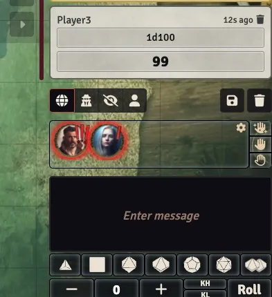
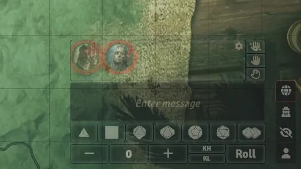
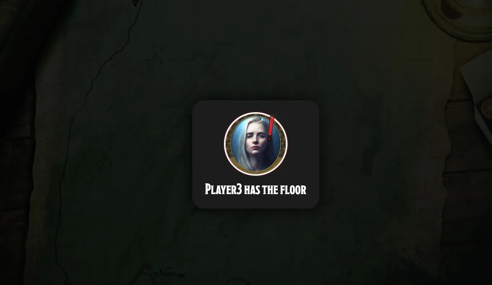
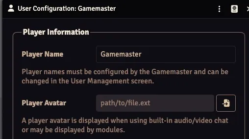

# Simple Requests


The request queue will be displayed above the chat. Create requests using the buttons on the right


## Overview

Players can create requests to express their desire to speak without those awkward pauses and interruptions in the voice chat.

Three tiers of importance help the GM to judge the urgency of the request


When sidebar is collapsed in v13.


## Usage

When a player clicks on their request, or when the GM right-clicks, the request is silently removed.

## Epic Prompt
When the GM clicks on a request, they "activate" the *top* request, triggering the activation sound and an "epic prompt" for all users



#### Macro to call out top request

```console
window.simpleRequests.gm_callout_top_request();
```

#### Macro to clear all requests

```console
window.simpleRequests.load_queue_requests_LOCAL_QUEUE([]);
```

### Image
Set via `Player Avatar` option in `User Configuration`. 


### Audio
Each level of request uses a different sound. GM can change in settings.

Volume level is determined by the user's `interface` setting

## Installation

Copy this URL into FoundryVTT's module installer:

```console
https://github.com/achoobert/FoundryVTT-Simple-requests/releases/latest/download/module.json
```

### thanks 
Nazgob made the original module

the other modules I coped best practices from: `raise-my-hand`, `dice-tray`

The heavy lifting here is done by socketLib 

```

---

## Features

- Simple-requests page in GM settings
- Uses the same UI look, DOM placement, and CSS structure as dice-calculator for the default (above chat message input) position
- Single source of truth for the queue (in-memory object, synchronized via SocketLib)
- Modular code: queue UI and logic can be reused regardless of UI state (docked and floating modes)
- Options to match notification features of `raise-my-hand`

### Basic

- [x] All requests and queue changes are synchronized across all clients (using SocketLib)
- [x] GM can customize an audio sound for each category of request
- [x] Render a queue UI below (or above) the chat input, inside the chat sidebar
- [x] Each request in the queue displays:
  - [x] The player's name and image (configurable: token, avatar, etc.)
  - [x] The request's importance level (Common, Important, Urgent), visually distinct
- [x] Provide buttons for players to add a request at any level
- [x] Players can remove their own requests by clicking (LMB or RMB)
- [x] GMs can remove any request with RMB, or "activate" a request with LMB (triggers a sound and chat message)
- [x] E2E tests for dev sanity

### Advanced

- [ ] Allow players to choose the image used for their request (token, avatar, etc.) via settings
- [ ] If no image is found, prompt the user to set one
- [ ] Allow the request queue to be moved from under the chat to a free position on the screen (via settings or Shift+LMB)
- [ ] Provide a button to return the queue to its default position
- [ ] Allow resizing the queue window via settings
- [ ] Ensure the UI is accessible and visually clear for all users

---

