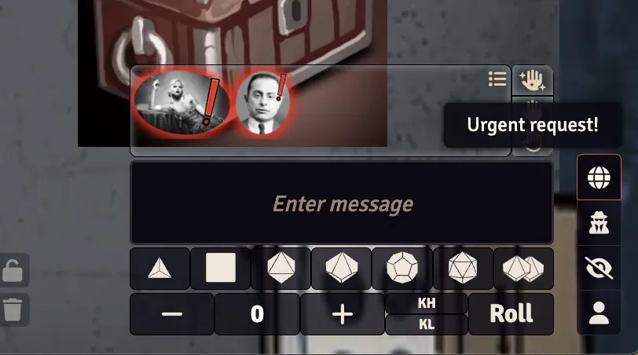
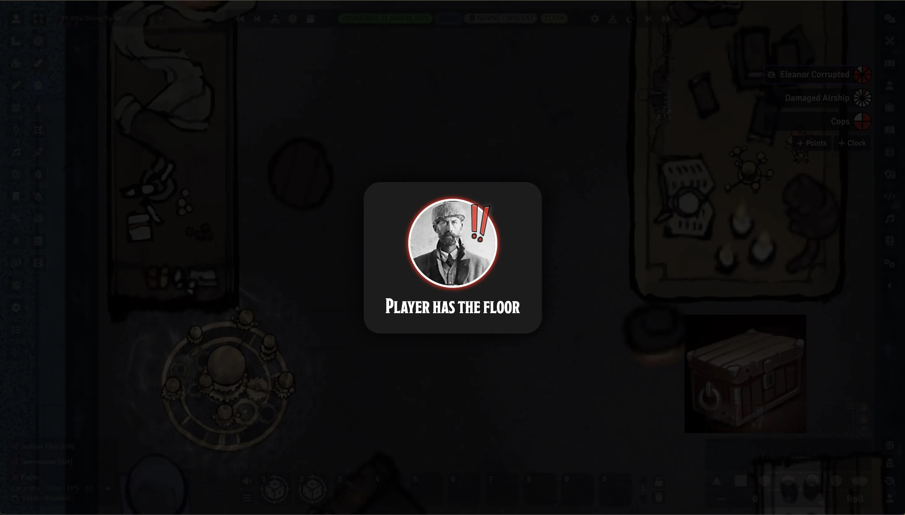
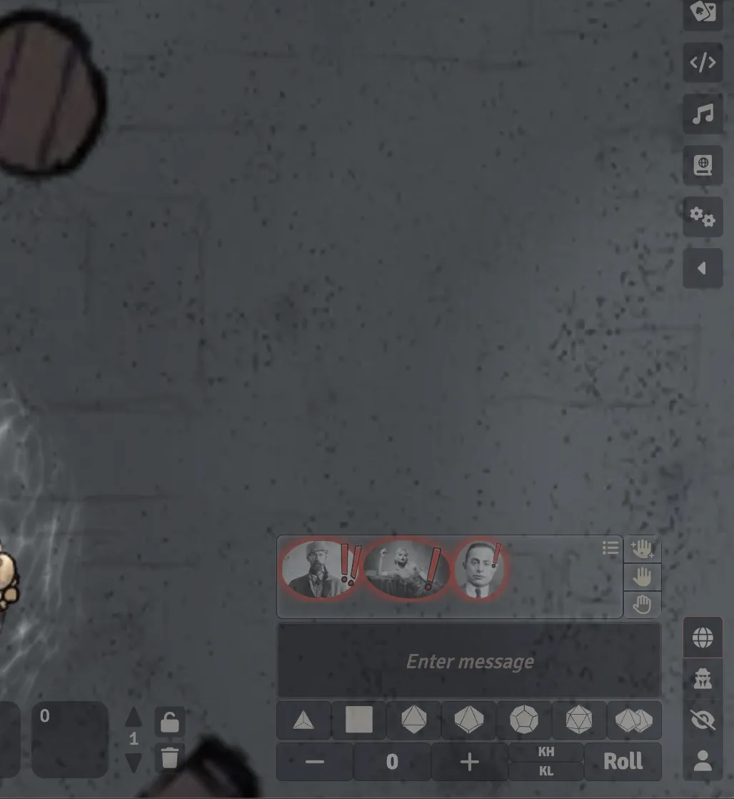
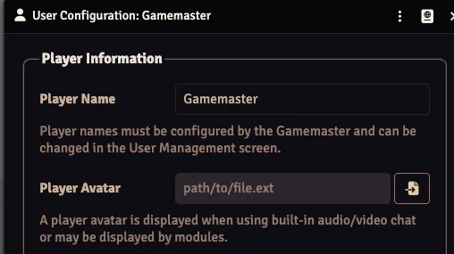

# Simple Requests

Players can create requests to express their desire to speak without those awkward pauses and interruptions in the voice chat.

Three tiers of importance help the GM to judge the urgency of the request

Queue is displayed above the chat-input. Create requests using the "🤚" buttons. Pop top request by left clicking on it, silently dismiss any request by right clicking. 





<video src="readme_imgs/example.mp4" controls playsinline style="max-width: 400px; width: 100%; height: auto;">
  Side-by-side example of the request queue in chat.
</video>

#### When sidebar is collapsed in v13+





#### Macro to call out top request

```console
window.simpleRequests.gm_callout_top_request();
```

#### Macro to clear all requests

```console
window.simpleRequests.load_queue_requests_LOCAL_QUEUE([]);
```

### Image
Set via `Player Avatar` option in `User Configuration`. 




### Audio
Each level of request uses a different sound. GM can change in settings.

Volume level is determined by the user's `interface` setting

## Installation

Copy this URL into FoundryVTT's module installer:

```console
https://github.com/achoobert/FoundryVTT-Simple-requests/releases/latest/download/module.json
```

### thanks 
Nazgob made the original module

the other modules I coped best practices from: `raise-my-hand`, `dice-tray`

The heavy lifting here is done by socketLib 

```

---

- [x] GM can customize an audio sound for each category of request
- [x] Render a queue UI above the chat input, inside the chat sidebar
- [x] Each request in the queue displays:
  - [x] The player's image and name on hover 
  - [x] The importance displayed via icons and motion
- [x] Buttons for players to set urgency level
- [x] Players can remove their own requests by clicking (LMB or RMB)
- [x] GMs can remove any request with RMB, or "activate" a request with LMB (triggers a sound and chat message)
- [x] E2E tests for dev sanity

### Potential future features (existed in original mod, but removed during port)

- [ ] If no image is found, prompt the user to set one
- [ ] Allow the request queue to be moved from under the chat to a free position on the screen (via settings or Shift+LMB)
- [ ] Provide a button to return the queue to its default position

---
